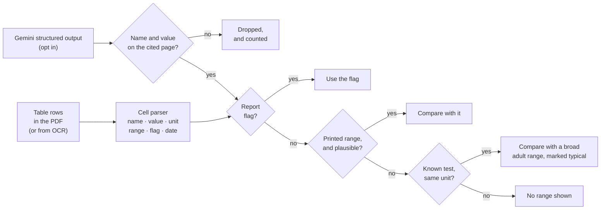
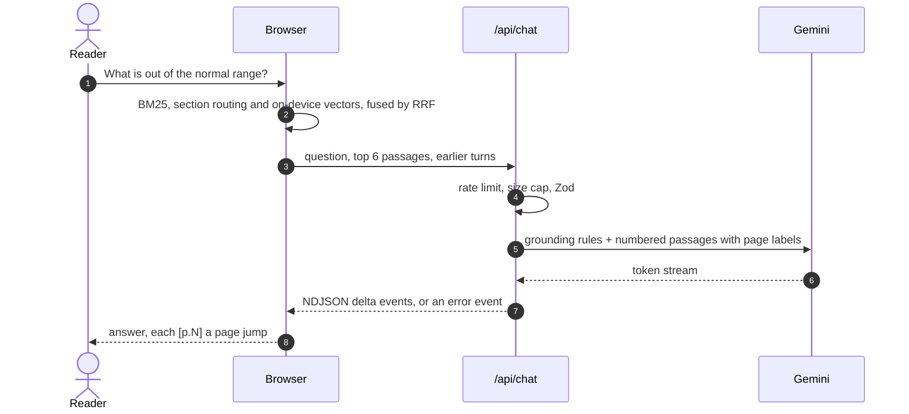

<p align="center">
  
</p>

<p align="center">
  <a href="https://github.com/kaificial/clairo-medical/actions/workflows/ci.yml"></a>
  
  
  
  
  
  
  
</p>

<p align="center">
  <a href="#what-it-does">What it does</a> ·
  <a href="#architecture">Architecture</a> ·
  <a href="#evaluation">Evaluation</a> ·
  <a href="#how-lab-results-are-read">Lab results</a> ·
  <a href="#how-a-question-is-answered">Grounded answers</a> ·
  <a href="#engineering">Engineering</a> ·
  <a href="#run-it-locally">Run it</a> ·
  <a href="#roadmap">Roadmap</a>
</p>

Clairo turns a lab, imaging, or discharge **PDF** into something a patient can
actually read. It pulls the lab results out of the report and shows which ones
are out of range, explains any term you highlight, and answers questions with a
citation to the page every claim came from.

The PDF is opened, read, indexed, and checked **in your browser**, scanned pages
included. Semantic search runs on the device too. The server never receives the
file, only the handful of passages a question needs, and only when the reader
asks for something that needs a language model.

<p align="center">
  <picture>
    <source media="(prefers-color-scheme: dark)" srcset="docs/readme/viewer-dark.webp">
    
  </picture>
</p>

> [!IMPORTANT]
> Clairo helps you understand your document. It is not a medical device, does
> not give a diagnosis, and does not replace your doctor.

## What it does

|                             |                                                                                                                                                                                                                                             |
| --------------------------- | ------------------------------------------------------------------------------------------------------------------------------------------------------------------------------------------------------------------------------------------- |
| **Lab results, called out** | Results are read from the report's tables on your device, grouped into trends when a test repeats ("was 1001 IU/L on 8 Oct"), and set against a range on a small gauge. Out of range tests sort to the top. Select one to jump to its page. |
| **Scanned reports**         | A page with no text layer is detected and offered to on-device OCR. The recognised text flows through the same pipeline, so a faxed lab panel still yields lab results, search and answers.                                                 |
| **Search that understands** | Keyword search is instant. Turn on semantic search and a 23 MB sentence model runs in a Web Worker, in your browser, fused with keywords and section routing. Nothing is sent. The cloud embedding model remains an option.                 |
| **Highlight to explain**    | Select any word or phrase in the PDF for a one or two sentence definition in plain language, anchored beside the highlight, with a page citation when the term appears in your report.                                                      |
| **Ask with citations**      | Ask "what is out of the normal range?" or "what should I ask my doctor?". Answers come only from your document, and every `[p.2]` is a button that jumps to that page.                                                                      |
| **Works without a key**     | With no AI key configured, the reader, OCR, lab results, and keyword and on-device semantic search all still work. Chat, explain and AI extraction are simply hidden.                                                                       |

Try it without a file: **Try the example** on the landing page opens a sample
discharge summary at `/viewer?example=1`.

## Design decisions

These are the choices the rest of the code follows.

1. **The model never decides what is abnormal.** Status comes from code, in a
   fixed order: the report's own flag, then the range printed beside the
   result, then a broad adult range, and only when the units match exactly. A
   model can help find results. It cannot grade them.
2. **Everything a model says is checked against the source.** Chat and
   definitions must cite pages, and citations render as page jumps, so a
   reader can check every claim. Lab rows a model extracts are dropped unless
   the test name and the value both appear on the page it cited.
3. **The document stays where it is.** Extraction, OCR, chunking, the BM25
   index, sentence embeddings, the vector store (IndexedDB) and retrieval all
   run in the browser. The server is stateless: it receives a question and a
   few passages, never a file.
4. **Measured, not guessed.** Retrieval strategies, the embedding model, and
   the lab parser are compared on a labelled corpus by `pnpm eval`, in CI. The
   model the app ships was chosen by that table, and section routing and two
   parser fixes came straight from its misses.
5. **Every spend is deliberate.** Nothing is embedded, recognised or sent just
   because a file was opened. Semantic search, OCR and AI lab extraction are
   explicit, per document actions, and the UI says what each one downloads or
   sends.
6. **The API is guarded like it costs money, because it does.** Each route has
   a per minute limit, they share a daily budget per caller, and bodies are
   size capped and validated with Zod before a provider is called.

## Architecture

<p align="center">
  
</p>

| Layer            | Where   | What it does                                                                                                                                                                                                                                                                                                     |
| ---------------- | ------- | ---------------------------------------------------------------------------------------------------------------------------------------------------------------------------------------------------------------------------------------------------------------------------------------------------------------- |
| `lib/pdf`        | browser | pdf.js text runs become lines, columns and tables. Running headers and footers are detected across pages and removed. Scanned pages are rendered to a canvas and read by tesseract.js, and the words become the same positioned text items. Blocks are chunked by heading at about 1,200 characters.             |
| `lib/retrieval`  | browser | BM25 over chunks, a section router that sends summary, plan, reason and medication questions to the headings that answer them, a dense strategy over an IndexedDB vector store keyed by document and model, and reciprocal rank fusion (k = 60) over each list's order. A failed strategy is dropped, not fatal. |
| `lib/embeddings` | browser | MiniLM L6 (quantized ONNX) in a Web Worker through transformers.js, loaded once per page and cached by the browser.                                                                                                                                                                                              |
| `lib/labs`       | browser | The lab parser, the analyte table, range assessment with plausibility checks, trend grouping, grounding for model output, and the gauge scale. Pure functions, no network.                                                                                                                                       |
| `app/api/*`      | server  | Four route handlers, each behind `lib/guard`: rate limit, body size cap, Zod schema.                                                                                                                                                                                                                             |
| `lib/ai`         | both    | Prompts, streaming as NDJSON events, structured output for lab rows, and error translation into messages a reader can act on. `server.ts` holds the key; `client.ts` is what the browser calls.                                                                                                                  |

## Evaluation

`pnpm eval` runs the real retrieval and lab code over six synthetic reports
(two lab panels, an SI unit liver panel with two dates per row, a CT, an MRI, a
discharge summary with vitals and doses) and writes
[`evals/results.md`](evals/results.md). It runs in CI with the models cached.

<p align="center">
  
</p>

| Retrieval (41 questions)               |   R@1 |    R@5 |   MRR | Lay language R@5 |
| -------------------------------------- | ----: | -----: | ----: | ---------------: |
| BM25 keywords                          | 65.9% |  75.6% | 0.707 |            61.9% |
| BM25 + section routing                 | 73.2% |  80.5% | 0.768 |            61.9% |
| BM25 + MiniLM (on device)              | 75.6% |  97.6% | 0.856 |           100.0% |
| **BM25 + MiniLM + sections (shipped)** | 80.5% | 100.0% | 0.892 |           100.0% |
| Gemini embeddings alone                | 82.9% |  95.1% | 0.886 |           100.0% |
| BM25 + Gemini + sections               | 80.5% | 100.0% | 0.894 |           100.0% |

What it showed, and what changed because of it:

- **Keywords alone fail lay language.** "Am I anemic?" and "Do I have an
  infection?" share no words with `Hemoglobin 11.2 L` or `WBC 12.4 H`: BM25 finds
  62% of such questions, every embedding model finds all of them.
- **A 23 MB model on the device matches the cloud.** Hybrid search with MiniLM
  and section routing scores 0.892 MRR against 0.894 for Gemini embeddings, so
  semantic search moved on device by default. Of the three local models
  compared (MiniLM, BGE small, GTE small), MiniLM was the best hybrid and the
  smallest download.
- **Summary questions needed routing, not a bigger model.** "What did the scan
  find overall?" was missed by every system, because nothing connects "overall"
  to a heading called IMPRESSION. A small section router fixed it and lifted
  every configuration.
- **The lab parser went from 86% to 100% recall** after the eval exposed a
  table layout it could not read (one column per date) and a vital sign it
  wrongly read as a result (`SpO2 96 %`). It now reads 43 of 43 results with no
  extras, and judges every status correctly.
- **Grounding holds.** Of 129 fabricated model rows (a nudged value, a test the
  report never mentions, a citation to the wrong page), all 129 were dropped,
  every genuine row was kept, and every invented range was stripped.

The corpus is small and was used during development, so treat these as
regression guards, not a benchmark. Retrieval differences of a point or two are
within noise.

## How lab results are read



**The parser reads cells by what they look like, not by column position.**
Extracted rows rarely line up with their header: in the sample report the row
number is sometimes its own cell and sometimes fused to the test name
(`10 AST`). So each row is scanned for a name, then the first result shaped
cell after it (`6.1`, `<0.5`, `1,001 H`, `140 mmol/L`), then whatever unit,
range, flag or date follows. A number beside a label is only kept when the
name is a known test or the row carries a unit or a range, which is what
keeps `Visit Number: 11186424686` and `MRN: 1234567` out. Vital signs are
excluded by name, and a header that prints one date per column yields one
reading per date.

**Typical ranges are deliberately broad and deliberately incomplete.** When a
report prints no range, Clairo compares with an interval wide enough to cover
the common published adult ranges, so a value is flagged only when most labs
would flag it too. Tests whose normal range depends on context the report may
not state are left out on purpose: random glucose, lipids (targets depend on
cardiac risk), and sex specific hormones. Names match exactly after
normalizing, so `Direct bilirubin` never borrows the total bilirubin range, and
a unit mismatch (`mmol/L` against a `mg/dL` range) means no comparison at all.

**A printed range is trusted, unless it cannot be right.** On the scanned test
fixture, OCR read potassium's `3.5-5.3` as `3.5-53`. A limit that far from every
published interval for a known test is set aside as misread, the typical range
is used instead, and the panel says so. The report's own `H` still decides the
status, and OCR pages carry a banner asking the reader to check values against
the image.

**Censored values are handled honestly.** `<0.5` is only judged when every
value it could stand for lands on the same side of the range.

On the bundled sample, the parser reads all 12 lab rows and nothing else,
groups them into 7 tests, and flags lactate, ALT and AST, which matches the
report's own summary that liver enzymes "remain slightly above normal values".
That exact outcome is a test (`src/lib/labs/sample.test.ts`) run against the
real PDF.

## How a question is answered



The instructions put grounding first: answer only from the passages, cite a
page for every claim, say plainly when the report does not answer, and never
guess a value. Questions about prognosis get a kind answer that points back to
what the report says and to the doctor who ordered it, rather than a refusal.
Passages travel with the newest question rather than the instructions, so each
turn is grounded in what retrieval found for that turn, and the context is
capped at 12,000 characters with the weakest passages dropped first.

When a provider fails, the reader sees why. A rate limit, a rejected key, an
overloaded model, a timeout and a missing model each get their own message,
and a stream that fails halfway keeps the part that already arrived.

## Engineering

- **257 unit tests** across the PDF pipeline, OCR conversion, retrieval and
  section routing, vector stores, lab parsing and assessment, request guards,
  prompts, streaming transport and error handling. Lab extraction is tested
  against a mock model (`MockLanguageModelV4`), including a model that invents
  a value and has it discarded.
- **9 Playwright tests in a real browser** against a production build, with
  every AI route mocked: lab results and page jumps, keyword and on-device
  semantic search, a streamed answer with citations, a rate limited answer,
  AI lab extraction, and **OCR of a scanned PDF fixture**. Three of them assert
  that no request reaches the app's API at all. The streaming test caught a
  real bug: the chat client rendered the NDJSON wire format as the answer.
- **An evaluation harness** in CI (see [Evaluation](#evaluation)).
- **CI on every push and PR**: `format:check → lint → typecheck → test → build`,
  then the eval and the end to end suite as separate jobs. Husky and
  lint-staged run Prettier and ESLint before each commit.
- **Strict TypeScript with no `any`**, and a validated environment
  ([`src/env.ts`](src/env.ts)) that fails the build with a readable message
  when a variable is malformed.
- **Accessibility built in**: tab roles wired to their panels, live regions for
  streamed answers, search results and model downloads, visible focus rings,
  and reduced motion respected by the hero and the demo.

### Stack

|           |                                                                                                                |
| --------- | -------------------------------------------------------------------------------------------------------------- |
| App       | Next.js 16 (App Router, Turbopack) · React 19 · TypeScript                                                     |
| UI        | Tailwind CSS v4 · shadcn/ui (Radix) · Motion · lucide · Newsreader and Geist                                   |
| PDF       | pdf.js (`pdfjs-dist`) via `react-pdf` · tesseract.js for OCR                                                   |
| On device | transformers.js (ONNX Runtime Web) · MiniLM L6 sentence embeddings in a Web Worker                             |
| AI        | Vercel AI SDK v7 · Gemini (chat and embeddings) · Claude on Amazon Bedrock as a backup · Zod structured output |
| Storage   | IndexedDB (vectors, in the browser)                                                                            |
| Quality   | Vitest · Playwright · ESLint · Prettier · Husky · GitHub Actions                                               |

## Run it locally

Requires Node 24 and pnpm 11.

```bash
pnpm install                 # also installs the Husky pre-commit hook
cp .env.example .env.local   # optional: add a key to switch on the AI features
pnpm dev
```

Open <http://localhost:3000>, then **Try the example**.

| Variable                       | Default                       | Purpose                                                                                                                                                                   |
| ------------------------------ | ----------------------------- | ------------------------------------------------------------------------------------------------------------------------------------------------------------------------- |
| `GOOGLE_GENERATIVE_AI_API_KEY` | none                          | A [Google AI Studio key](https://aistudio.google.com/apikey). Switches on chat, definitions, AI lab extraction and cloud semantic search.                                 |
| `AI_CHAT_MODEL`                | `google/gemini-3.7-flash`     | Chat, definitions and lab extraction, as `provider/model`. A comma separated list makes the later models backups, tried in order if the first one fails before answering. |
| `AI_EMBEDDING_MODEL`           | `google/gemini-embedding-001` | Cloud semantic search. On-device search needs no key.                                                                                                                     |
| `AWS_PROFILE`                  | none                          | On a laptop, the AWS CLI profile to use for `bedrock/*` models (sign in first with `aws sso login`).                                                                      |
| `AWS_ROLE_ARN`                 | none                          | On Vercel, the role the site borrows for `bedrock/*` models. It comes from `terraform output vercel_role_arn`, so no AWS keys are stored.                                 |
| `BEDROCK_REGION`               | `us-east-1`                   | Where Bedrock calls go.                                                                                                                                                   |
| `SKIP_ENV_VALIDATION`          | unset                         | Set to `1` to build with an invalid environment.                                                                                                                          |

A model id naming a provider the server can't sign in to is skipped, and if
none are left the feature is switched off rather than failing mid request.

| Script           | What it does                                                                   |
| ---------------- | ------------------------------------------------------------------------------ |
| `pnpm dev`       | Dev server (Turbopack)                                                         |
| `pnpm build`     | Production build, validating the environment first                             |
| `pnpm start`     | Serve the production build                                                     |
| `pnpm lint`      | ESLint                                                                         |
| `pnpm typecheck` | `next typegen` and `tsc --noEmit`                                              |
| `pnpm test`      | Vitest unit tests                                                              |
| `pnpm test:e2e`  | Playwright against a production build (`PW_CHANNEL=chrome` to use your Chrome) |
| `pnpm eval`      | The evaluation harness; `EVAL_CLOUD=1` adds Gemini embeddings                  |
| `pnpm format`    | Prettier                                                                       |

The landing page plays `public/demo.mp4` beside the headline when the file
exists, and leaves the space out when it does not.

## Project layout

```
src/
  app/
    page.tsx              Landing page
    viewer/page.tsx       The reader (?example=1 opens the sample)
    api/                  chat · define · embed · labs route handlers
  components/
    viewer/               PDF view with OCR, search, lab results, chat, explain popover
    ui/                   shadcn/ui primitives
  lib/
    pdf/                  Layout aware extraction, header and footer removal, OCR, chunking
    retrieval/            BM25, section routing, dense search, vector stores, fusion
    embeddings/           On-device sentence models in a Web Worker
    labs/                 Lab parser, analytes and ranges, assessment, trends, grounding
    ai/                   Prompts, streaming transport, structured extraction, failures
    guard.ts              Rate limiting and request validation
  env.ts                  Typed, validated environment
evals/                    Synthetic corpus, metrics, harness, results
e2e/                      Playwright tests and the scanned PDF fixture
docs/readme/              Banner, diagrams, chart, screenshots
```

## Privacy

- Opening, reading, OCR, searching and checking lab results never leave the
  browser.
- On first use, on-device search downloads its model from Hugging Face and
  ONNX Runtime from jsDelivr, and OCR downloads tesseract.js and its English
  model from jsDelivr. These are downloads only; nothing about the document is
  sent, and the browser caches them.
- A question sends the question and up to 6 matching passages. A definition
  sends the highlighted text and up to 4 passages. Cloud semantic search, if
  chosen instead of on-device, sends the report's chunk text once. AI lab
  extraction sends only passages that look like measurements, and skips tables
  that merely contain digits, such as names with dates of birth or phone
  numbers.
- No document text is stored on the server.
- Check your AI provider's data terms before using real records. On Google's
  unpaid Gemini API tier, submitted content may be used to improve Google's
  products; a paid tier changes that.

## Roadmap

- [x] An evaluation harness for retrieval, lab parsing and grounding, in CI.
- [x] OCR for scanned reports that have no text layer.
- [x] In-browser embeddings, so semantic search sends nothing.
- [x] Playwright end to end tests against a mocked model.
- [ ] Deploy, with rate limits moved from per instance memory to a shared store
      (Redis) or platform firewall rules.
- [ ] Answer faithfulness in the eval: citation accuracy and an LLM judge on
      generated answers.
- [ ] Optional accounts and Postgres with pgvector, for trends across reports.
- [ ] Explanations in other languages, and a reading level control.

## Disclaimer

Clairo explains what a document says. It does not interpret what a result means
for your health, and it is not a substitute for the clinician who ordered the
test. The bundled example is a public sample discharge summary; everything in
`evals/` and `e2e/fixtures/` is synthetic.
